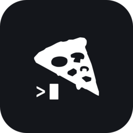

<p align="center">
  
</p>

<h1 align="center">PzzaCode</h1>

<p align="center">
  A grid terminal manager for agentic coding — run and watch many terminals and
  AI coding agents across your machines, from one fast cockpit.
</p>

<p align="center">
  
  
  
  
  
  
</p>

---

Every tile is a live terminal — a shell or a coding agent (Claude Code, Codex).
Tiles are backed by **tmux** sessions on the device, so closing the app just
detaches: everything keeps running and comes back exactly where you left it.
Runs in the browser (talking to a small agent on the device) or as a native
desktop app.

## Features

- 🪟 **Grid of terminals** — see and drive every session at once; drag to reorder, maximize, or resize a tile.
- 🗂️ **Workspaces** — browser-style tabs group sessions, each with its own grid layout, icon and color.
- 🎯 **Focus & dim** — spotlight one tile, dim the rest, or grey out everything but the one you clicked.
- ⌨️ **Keyboard shortcuts** — `⌥1–9` switch workspaces, `⌃1–9` jump to a tile, `⌘V` pastes an image straight to your agent (even over SSH).
- 🖥️ **Per-device agents** — a small agent serves each machine's terminals, ports and saved state; a setup wizard installs it on a new device over SSH.
- 🔀 **Auto port forwarding** — the device's listening ports are mirrored to your machine automatically.
- 🖧 **Remote desktop (RDP)** — open a device's Linux desktop over an SSH-tunneled session.
- 🧩 **MCP** — expose your sessions and ports to Claude / Codex / Zed / Cursor / Windsurf.
- 📊 **Live agent usage** — Claude / Codex 5-hour and weekly windows, reset countdowns and plan, read straight from the accounts on the device.
- 👥 **Multi-account** — launch a session bound to a specific Claude or Codex account.

## How it works

The **agent** (`server/`) runs on each device — Node + `node-pty` + tmux — and
serves terminals, ports, saved state and usage over a small HTTP/WebSocket API,
bound to loopback. The app connects to it directly on the device, or over SSH
from another machine. Under the desktop build the same primitives run natively
in Rust.

## Getting started

Install the agent on a device (Node 18+ and tmux required):

```bash
./install.sh
```

Run the app locally:

```bash
npm install
npm run dev
```

Then open the printed URL. From **Add a device** in the setup wizard you can
install the agent on any other machine you can SSH into.

## Tech stack

- **Frontend:** React 18 · TypeScript · Vite · zustand · xterm.js (WebGL) · framer-motion
- **Desktop:** Tauri 2 (Rust, portable-pty)
- **Agent:** Node · node-pty · ws
- **Sessions:** tmux
